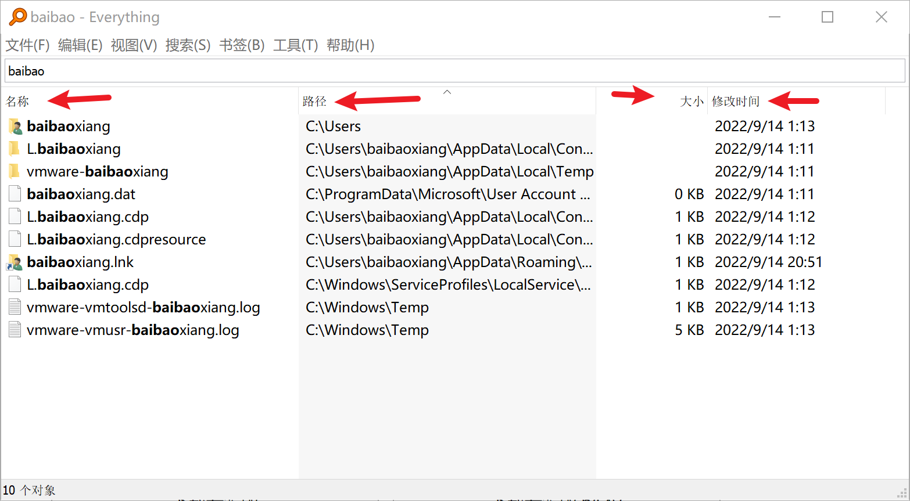

## 简介
Everything 是一款基于名称快速定位文件和文件夹的软件。搜索速度飞快，基本秒搜。

Everything 只能根据文件名来搜索，不能搜索文件内容，如想搜索文件内容，可使用 Anytxt 等全文搜索工具。

推荐理由：软件小巧，搜索速度飞快。

### 基本信息
- 软件名：Everything
- 官网地址： https://www.voidtools.com/zh-cn/
- 开发者：David Carpenter
- 下载地址： https://www.voidtools.com/zh-cn/downloads/

## 下载安装
下载完按照提示安装即可，推荐使用「安装版」，「便携版」可以放 U盘使用。
不清楚的可以参见官方指导，非常详细：[安装 Everything](https://www.voidtools.com/zh-cn/support/everything/installing_everything/)

## 功能介绍
### 创建索引
Everything 首次使用会新建索引，创建索引的速度非常快。Everything 仅索引文件和文件夹名，一般仅需几秒便可建立其数据库。全新安装的 Windows 10 (大约 120,000 个文件) 仅需 1 秒即可索引完成。索引 1,000,000 个文件将需要大约 1 分钟。[^1]

### 搜索
#### 关键词直接搜索
直接在搜索框输入关键字进行搜索。默认全盘搜索，可以凭借记忆输入文件名关键字 + 文件类型后缀来搜索。例如：```设计文档 .ppt``` ，输入搜索字符会实时搜索结果，根据结果列表可以按照文件路径、大小、文件类型进行排序。



这个是最常用的方法，基本可以满足大多数场景。

#### 搜索特定目录
可以按照目录来搜索，简单方法是将 Everything 集成到系统右键菜单上(默认安装未勾选)，右键文件夹直接搜索，如下图所示。

**工具 --> 选项 --> 常规：**
![[../res/everything/everything-添加右键菜单.png]]

右键使用 Everything 搜索：
![[../res/everything/everything-右键菜单.png]]

或直接手动输入
例如，搜索文件夹 D:\\Downloads 中文件和文件夹：```D:\downloads\ ```

使用双引号以转义空格，搜索 C:\\Program Files 下文件和文件夹：```"C:\Program Files\" ```

![[../res/everything/everything-目录搜索.png]]

#### 搜索特定文件类型
输入关键字 + 文件后缀即可，如 `设计规格 *.xlsx`

#### 使用筛选器搜索
筛选器是预定义的搜索。Everything 内置了常用的几种搜索类型，如文档、图片、视频等。输入关键字后，直接选用筛选器进行筛选。

1、输入关键字
![[../res/everything/everything-筛选器输入关键字.png]]

2、菜单栏 --> 搜索 --> 选择「图片」
![[../res/everything/everything-筛选器使用.png]]

3、显示筛选结果
![[../res/everything/everything-筛选器使用后.png]]

#### 自定义筛选器
除了内置的筛选器，我们还可以自定义。我们先查看下内置筛选器参数设置。

菜单 --> 搜索 --> 管理筛选器；选中「图片」，点击「编辑」；可以看到「搜索」项中，填入 `ext` 命令 + 图片文件后缀。 
![[../res/everything/everything-筛选器参数定义.png]]

我们参照上图添加一个 markdown 文件筛选器：
![[../res/everything/everything-筛选器markdown.png]]

保存后即可使用，更多搜索语法请见 [官方搜索语法说明](https://www.voidtools.com/zh-cn/support/everything/searching/)，或者直接打开「帮助」菜单，点击「搜索语法」。

#### 书签使用
常用的搜索我们可以保存成书签，一键搜索。

输入关键字，搜索完成，点击菜单 --> 书签 --> 添加到书签，然后保存。使用的时候直接选择对应书签即可。

![[../res/everything/everything-书签使用.png]]

### HTTP 服务器
Everything 支持 http、etp/ftp 服务器，开启后你可以通过网络浏览器搜索和访问共享的文件。公司内部文件服务器资料共享可以使用本功能。

菜单 -->工具 --> 选项 --> HTTP 服务器 --> 启用 HTTP 服务器 -->确定。

浏览器输入本机 IP 可以直接搜索。
![[../res/everything/everything-http服务器.png]]

## 扩展阅读
- [官方 支持文档 - voidtools](https://www.voidtools.com/zh-cn/support/everything/)
	- 注：里面详细讲解了Everything 使用的方方面面
- [官方 搜索指导 - voidtools](https://www.voidtools.com/zh-cn/support/everything/searching/)
	- 注：介绍了所有搜索方法，正则搜索等
- [官方 HTTP服务器 - voidtools](https://www.voidtools.com/zh-cn/support/everything/http/)

## 参考
- [1]:["Everything" 索引全部文件需要多长时间？ - voidtools](https://www.voidtools.com/zh-cn/faq/#everything_%E7%B4%A2%E5%BC%95%E5%85%A8%E9%83%A8%E6%96%87%E4%BB%B6%E9%9C%80%E8%A6%81%E5%A4%9A%E9%95%BF%E6%97%B6%E9%97%B4%EF%BC%9F)


